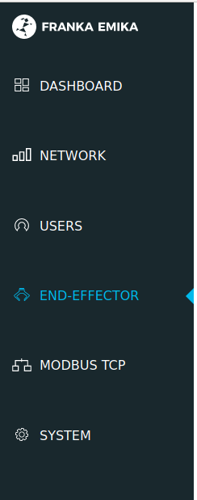
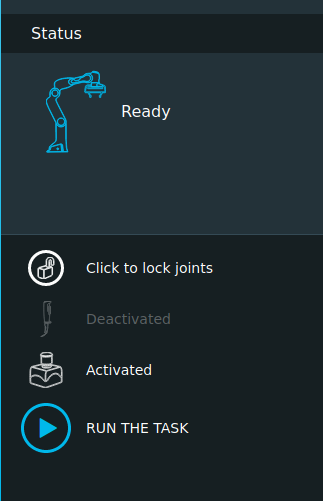

# 2D picking 

This part is a toturial to finish the 2D picking task. Before doing this part you need to finish 2D calibration part fist. If not,please finish it.

## Experiment theory

The color image obtained by the sensor and the visual recognition algorithm are used to calculate the grasping point, and the manipulator is controlled to reach the grasping point to complete grasping.In this experiment, the latest YOLO5 object detection algorithm was used to obtain the object Bounding Box, and the grabbing point was the center of the object Bounding Box.

## Enalbe the end-effector

Choose the end-effector.



Enalbe the end-effector and ready



## Run the code of 2D picking

Detailed tutorials are recorded in the document: [ME336 Lab Project Manual #2D-picking](https://bionicdl.feishu.cn/docs/doccnfGyDtcYwfkxvA0mFD2CVkd#AMoJHy)

The code is divided into three parts: Object Detection, Pose Recognization and Robot Operating.

### Object Detection

 We use a trained Yolo5 model provided in the project to detect the trash.

```python
# import the Yolo 5 library
from deepclaw.modules.end2end.yolov5.YOLO5 import Yolo5
# read trained Yolo5 model
object_detector = Yolo5 ('./configs/basic_config/yolov5_cfg.yaml')
# choose region of interest
crop_bounding = [340, 700, 340, 1200]
# detect the trash
ret, uv, cla, cfi = detectObject(object_detector, crop_bounding)
```

### Pose Recognization

In the `Object Detection` Part, we get the object region in the image stored in the viriable `uv`, so that we can derive the position and orientation of the object.  

#### Position

For the postion of the object, We first get the center pixel of the target object. Based on the calibration data obtained from the hand-eye calibration, the position to be set on the XY plane of the franka can be calculated.

```python
# the center pixel of the target object.
# col
ux = (uv[0] + uv[2]) / 2.0
# row
vy = (uv[1] + uv[3]) / 2.0
temp = hand_eye.cvt(ux, vy)
```

#### Orientation

For the orientation of the object, We can judge whether the object is horizontal or vertical by comparing the length and width of the object image region.


```python
if abs(uv[2] - uv[0]) >= abs(uv[3] - uv[1]):
    # horizontal
    angle = 1.57
else:
    # vertical
    angle = 0
```

### Robot Operating

To operate the franka, we need to set the target pose of the end effector.

For the API of Franka, the position is the three-dimensional vector form of the Cartesian, while the orientation needs to be converted to Rodrigs vector form.

For Z components in the position, we cannot use the position of the end effector when calibration, as we use different end effectors. For this value, we need to get a suitable value by multiple tests.

```python
# set the position 
z = 0.03
temp_pose = [temp[0], temp[1], z, 3.14, 0, angle]
pick_pose = [temp_pose[0], temp_pose[1], temp_pose[2], rvc[0], rvc[1], rvc[2]]
# orientation transform
r = R.from_euler('xyz', temp_pose[3:6], degrees=False)
rvc = r.as_rotvec()
pick_pose = [temp_pose[0], temp_pose[1], temp_pose[2], rvc[0], rvc[1], rvc[2]]
        
# grasping
pick_place(robot, robot, home_joints, pick_pose, place_xyzrt)
```
