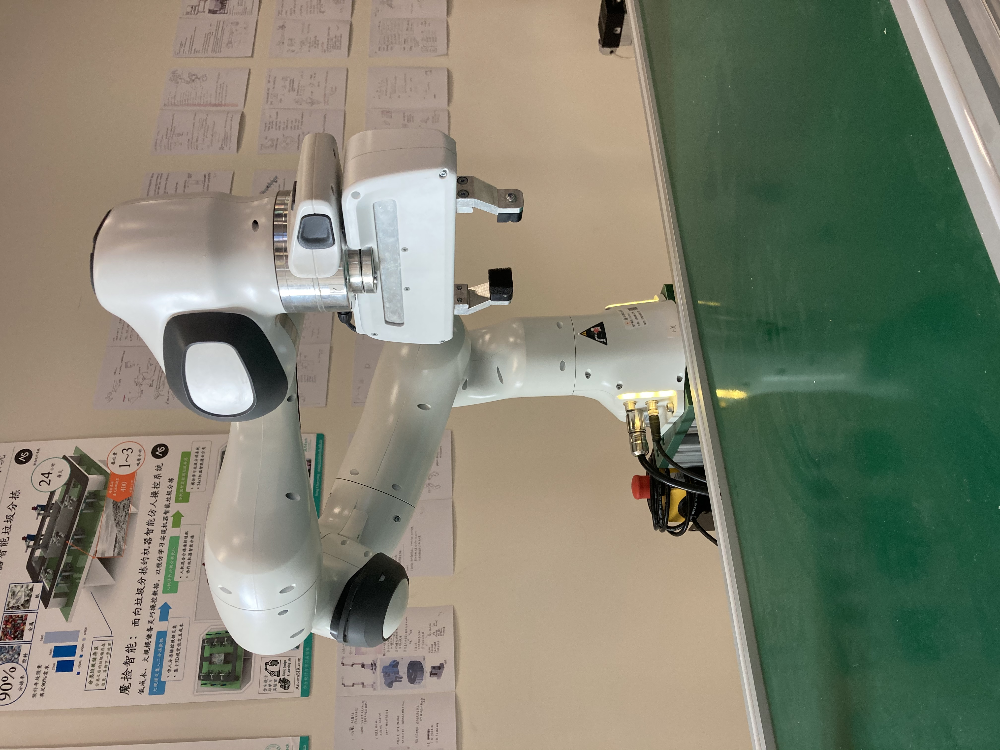

# BionicDL-CobotLearning-Project1: 2D Picking of (x,y)

In this project, we reproduce a learning algorithm using 2D images to conduct a simple picking task by identifying the object location. 

In this project, we use *Franka panda* and *Franka hand* to implement picking object by using 2D image from *Intel D435I*. 
First, we set up *Franka arm* by following the tutorial document. 
Then we set up all the environment in PC. After that, we performed 2D calibration. Finally, we followed the tutorial document to implement picking 
task.

We also provide a video to show our work in the bottom.

## Equipments

**Cobot**: 7-DOF Franka Emika Panda. [Detailed datasheet](https://s3-eu-central-1.amazonaws.com/franka-de-uploads/uploads/Datasheet-EN.pdf) 


Franka panda, Franka hand, Intel D435I, PC(msi Trident3)

## Franka arm set up

[Franka panda setting up tutorial ](https://bionicdl.feishu.cn/docs/doccnfGyDtcYwfkxvA0mFD2CVkd#B8wucg)


## Environment Setup

The neccessary 3rd-part library is recorded in the file `Requirements.txt`

```
Cython
matplotlib>=3.2.2
numpy>=1.18.5
opencv-python>=4.1.2
pillow
PyYAML>=5.3
scipy>=1.4.1
tensorboard>=2.2
tqdm>=4.41.0

pyrealsense2
torch==1.6.0
torchvision==0.7.0
```

run the following command to setup the environment.

```bash
pip install -r requirements.txt
```

## Quick Start

### Step1: 2D Calibration

[2D calibration tutorial](./calibration/ReadMe.md)

### Step2: Pick the target
[2D picking target tutorial](./2Dpicking/readme.md)

## Final video

[video link of BiliBili](https://www.bilibili.com/video/BV1RA411N7ST/)

[video link of YouTube](https://www.youtube.com/watch?v=31S3JaH5w9s)
