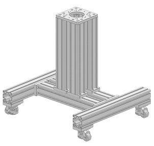

# BionicDL-CobotLearning-Project1: 2D Picking of (x,y)

In this project, we reproduce a learning algorithm using 2D images to conduct a simple picking task by identifying the object location. 

In this project, we use *Franka panda* and *Franka hand* to implement picking object by using 2D image from *Intel D435I*. 
First, we set up *Franka arm* by following the tutorial document. 
Then we set up all the environment in PC. After that, we performed 2D calibration. Finally, we followed the tutorial document to implement picking 
task.

We also provide a video to show our work in the bottom.

## Equipments

**Cobot**: 7-DOF Franka Emika Panda. [Detailed datasheet](https://s3-eu-central-1.amazonaws.com/franka-de-uploads/uploads/Datasheet-EN.pdf) 


**End effector:** Franka Hand:


**Depth Camera:** Intel RealSense D435i.The depth camera is fixed on a portal frame. [Detailed datasheet](https://www.intelrealsense.com/wp-content/uploads/2020/06/Intel-RealSense-D400-Series-Datasheet-June-2020.pdf) 


**PC:** MSI trident3


**Support structure:** The Franka cobot is installed on a moveable base structure designed as shown in the figure below. 


During Hand-eye calibration process, we use 3D-print made tapered objects to align the end effector of the cobot and the camera position.
 

## Franka arm set up

[Franka panda setting up tutorial ](https://bionicdl.feishu.cn/docs/doccnfGyDtcYwfkxvA0mFD2CVkd#B8wucg)


## Environment Setup

The neccessary 3rd-part library is recorded in the file `Requirements.txt`

```
Cython
matplotlib>=3.2.2
numpy>=1.18.5
opencv-python>=4.1.2
pillow
PyYAML>=5.3
scipy>=1.4.1
tensorboard>=2.2
tqdm>=4.41.0

pyrealsense2
torch==1.6.0
torchvision==0.7.0
```

run the following command to setup the environment.

```bash
pip install -r requirements.txt
```

## Quick Start

### Step1: 2D Calibration

[2D calibration tutorial](./calibration/ReadMe.md)

### Step2: Pick the target
[2D picking target tutorial](./2Dpicking/readme.md)

## Algorithm:
We also implement a different algorithm to perform the 2D picking task. Details in [here](./2Dpicking/readme.md). The codes are pasted in the Appendix.
Our new algorithm implements that the hand can pick up the object for different orientation. 

## Final video

[video link of BiliBili](https://www.bilibili.com/video/BV1RA411N7ST/)

[video link of YouTube](https://www.youtube.com/watch?v=31S3JaH5w9s)

## Appendix:
new-2d-picking.py:
```
if __name__ == '__main__':
    """ Initialization """
    # camera and robot driver
    robot = FrankaController('./configs/basic_config/franka.yaml')
    camera = Realsense('./configs/basic_config/camera_rs_d435.yaml')
    object_detector = Yolo5('./configs/basic_config/yolov5_cfg.yaml')

    home_joints = [-0.0347, -0.6137, 0.0812, -2.175, 0.0849, 1.7349, 0.4538]
    robot.move_j(home_joints, 1.5, 1.5)
    robot.gripperOpen()

    """ start picking loop"""
    place_xyzrt = [0.5, -0.3, 0.2, 3.14, 0.0, 0.0]
    crop_bounding = [340, 700, 340, 1200]

    cali_path = './configs/basic_config/cali2D.yaml'

    frame = camera.get_frame()
    color = frame.color_image[0]
    cv2.namedWindow("target", 0)
    cv2.namedWindow("target2", 0)
    while True:
        time.sleep(3)
        cv2.imshow("target", color)
        cv2.waitKey(1)
        time.sleep(0.1)

        frame = camera.get_frame()
        color = frame.color_image[0]

        # 识别物体
        # region_class = object_detector.detect(color)
        ret, uv, cla, cfi = detectObject(object_detector, crop_bounding, color)


        if not ret:
            print("no target")
            continue
        if cla not in [0, 1, 2, 3]:
            print('\033[1;35m Error Category \033[0m!')
            continue
        """ generate grasping pose"""


        # col
        ux = (uv[0] + uv[2]) / 2.0
        # row
        vy = (uv[1] + uv[3]) / 2.0


        target = color[int(vy-100):int(vy+100), int(ux-100):int(ux+100), :]
        target_gray = target[:, :, 1]-target[:, :, 2]

        retval, target_binary = cv2.threshold(target_gray, 100, 255, cv2.THRESH_BINARY)
        kernel = np.ones((30, 30), dtype=np.uint8)
        cv2.erode(target_binary,kernel,3)
        cv2.dilate(target_binary, kernel, 3)

        contours, hierarchy = cv2.findContours(target_binary, cv2.RETR_EXTERNAL, cv2.CHAIN_APPROX_SIMPLE, )
        #
        areas = []
        for c in range(len(contours)):
            areas.append(cv2.contourArea(contours[c]))
        max_id = areas.index(max(areas))

        rect = cv2.minAreaRect(contours[max_id])
        cv2.drawContours(target_binary,contours,max_id,100,-1)
        width = rect[1][1]
        height = rect[1][0]
        theta = rect[2]

        if width>height:
            theta = theta+90
        theta = 90-theta

        angle = math.pi*theta/180.0
        print("rect: {}".format(rect))
        print("theta: {}".format(theta))
        # cv2.line(target_binary,(int(rect[0][0]),int(rect[0][1])),(int(rect[1][0]),int(rect[1][1])),100,10)
        cv2.imshow("target2", target_binary)

        point_tl = (uv[0], uv[1])
        point_tr = (uv[0], uv[3])
        point_bl = (uv[2], uv[1])
        point_br = (uv[2], uv[3])
        cv2.line(color, point_tl, point_tr, (0, 0, 255), 10)
        cv2.line(color, point_tr, point_br, (0, 0, 255), 10)
        cv2.line(color, point_br, point_bl, (0, 0, 255), 10)
        cv2.line(color, point_bl, point_tl, (0, 0, 255), 10)
        cv2.imshow("target", color)


        cv2.waitKey(1)

        hand_eye = Calibration2D(cali_path)

        # print("<{},{}>".format(ux,uv))
        temp = hand_eye.cvt(ux, vy)
        z = 0.03
        # if abs(uv[2] - uv[0]) >= abs(uv[3] - uv[1]):
        #     angle = 1.57
        # else:
        #     angle = 0
        # grasp pose in euler angle
        # temp_pose = [temp[0], temp[1], z, 3.14, 0, 1.57]
        # transfer to rotation vector
        # r = R.from_euler('xyz', temp_pose[3:6], degrees=False)

        # rvc = r.as_rotvec()
        # pick_pose = [temp_pose[0], temp_pose[1], temp_pose[2], rvc[0], rvc[1], rvc[2]]
        # pick_pose = [temp[0], temp[1], z, 3.14, 0, angle]
        pick_pose = [temp[0], temp[1], z , 3.14, 0, angle]
        # grasping
        pick_place(robot, robot, home_joints, pick_pose, place_xyzrt)
```

olf-2d-picking.py:
```
if __name__ == '__main__':
    """ Initialization """
    # camera and robot driver
    robot = FrankaController('./configs/basic_config/franka.yaml')
    camera = Realsense('./configs/basic_config/camera_rs_d435.yaml')
    object_detector = Yolo5 ('./configs/basic_config/yolov5_cfg.yaml')

    home_joints = [-0.0347, -0.6137, 0.0812, -2.175, 0.0849, 1.7349, 0.4538]
    robot.move_j(home_joints, 1.5, 1.5)

    """ start picking loop"""
    place_xyzrt = [0.3, 0.0, 0.4, 3.14, 0.0, 0.0]
    crop_bounding = [340, 700, 340, 1200]
    cali_path = './configs/basic_config/cali2D.yaml'
    while 1:
        frame = camera.get_frame()
        color = frame.color_image[0]
        # 识别物体
        # region_class = object_detector.detect(color)
        ret, uv, cla, cfi = detectObject(object_detector, crop_bounding)
        if not ret:
            continue
        if cla not in [0, 1, 2, 3]:
            print('\033[1;35m Error Category \033[0m!')
            continue
        """ generate grasping pose"""
        hand_eye = Calibration2D(cali_path)
        # col
        ux = (uv[0] + uv[2]) / 2.0
        # row
        vy = (uv[1] + uv[3]) / 2.0
        temp = hand_eye.cvt(ux, vy)
        z = 0.03
        if abs(uv[2] - uv[0]) >= abs(uv[3] - uv[1]):
            angle = 1.57
        else:
            angle = 0
        # grasp pose in euler angle
        temp_pose = [temp[0], temp[1], z, 3.14, 0, angle]
        # transfer to rotation vector
        r = R.from_euler('xyz', temp_pose[3:6], degrees=False)
        rvc = r.as_rotvec()
        pick_pose = [temp_pose[0], temp_pose[1], temp_pose[2], rvc[0], rvc[1], rvc[2]]
        # grasping
        pick_place(robot, robot, home_joints, pick_pose, place_xyzrt)
```        
